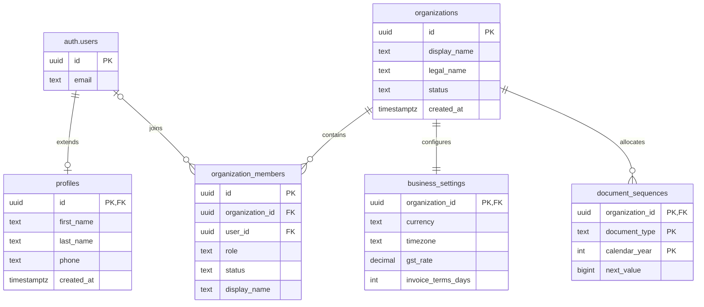
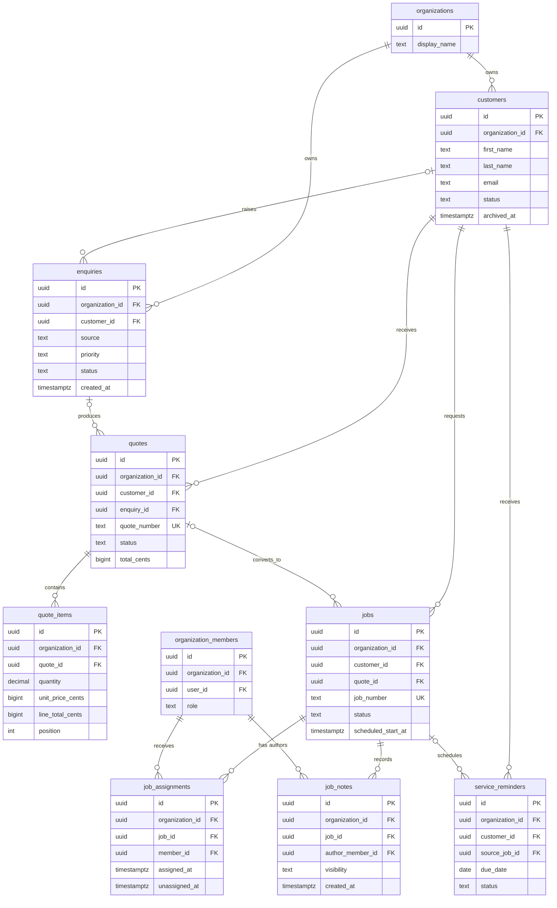
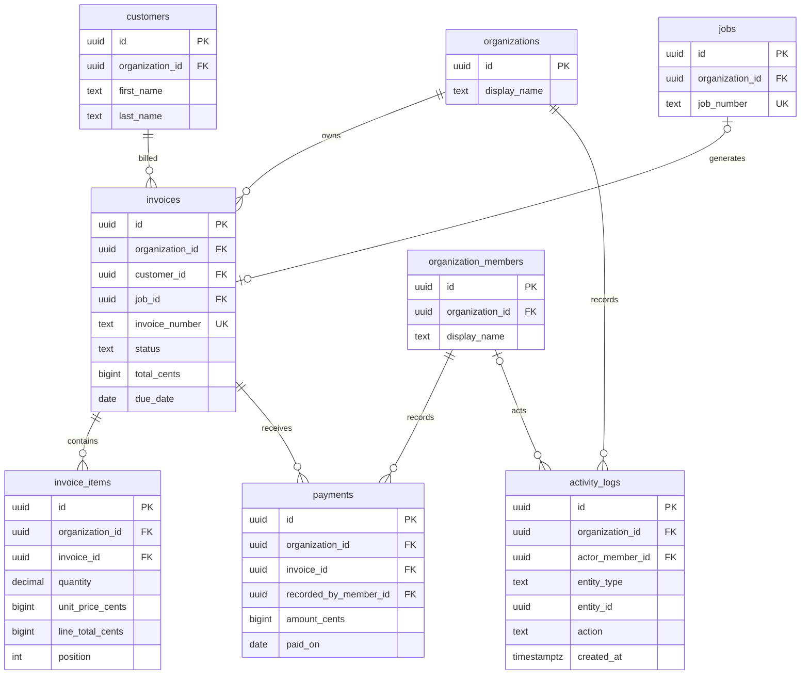

# KiwiOps database design

Status: proposed for Milestone 2 review. This document contains no migration SQL.

## 1. Goals

The database must:

- keep every organization's data isolated at the database layer;
- preserve the workflow from enquiry through payment without copying whole records between stages;
- support one user belonging to more than one organization;
- keep financial and historical records stable after customer details or prices change;
- support owner, admin, and technician access through Supabase Row Level Security (RLS);
- make common operational queries fast without indexing every column;
- stay simple enough for the MVP to maintain.

The design assumes PostgreSQL on Supabase and Supabase Auth. Passwords and authentication credentials remain in `auth.users`; KiwiOps does not store passwords.

## 2. Core decisions

### UUIDs and business numbers

All main records use UUID primary keys generated by PostgreSQL. UUIDs are suitable because they are difficult to enumerate, can be generated without a central application process, and remain unique when data is imported or created by different services.

UUIDs are used for profiles, organizations, memberships, customers, enquiries, quotes, quote items, jobs, assignments, notes, invoices, invoice items, payments, reminders, and activity logs.

Human-readable references are separate business identifiers:

- `Q-2026-0001`
- `JOB-2026-0042`
- `INV-2026-0024`

These references are mutable presentation concerns and are only unique inside an organization. They must not be primary keys or foreign keys. A small `document_sequences` table provides concurrency-safe numbering per organization, document type, and calendar year. Number allocation must happen in a database transaction that locks the counter row.

### Organization ownership

Every organization-owned table carries `organization_id`, including child tables such as `quote_items`, `invoice_items`, `job_assignments`, and `job_notes`.

This is intentional duplication. It provides:

- simple and auditable RLS predicates;
- fast organization-scoped queries and indexes;
- protection against cross-organization parent/child links through composite foreign keys;
- fewer joins in authorization checks.

The application must not infer ownership only through a chain such as quote item → quote → customer. Each child has a composite foreign key such as `(organization_id, quote_id)` referencing the parent's `(organization_id, id)` key. This makes a mismatched organization fail at the database constraint layer.

`profiles` is global to a Supabase user and does not have `organization_id`. `organizations` is the tenant root. Every other business table is tenant-owned.

### Money and tax

Stored monetary amounts use integer minor units (`bigint` cents for NZD) rather than floating point:

- `$80.00` is stored as `8000`.
- quantities use `numeric(12,3)` so values such as `1.5` hours are exact;
- tax rates use `numeric(7,4)` percentages, so `15%` is stored as `15.0000`;
- line subtotals, tax, and totals are rounded to the currency's minor unit and stored as integer amounts.

Integer minor units make equality checks and invoice balances predictable. The currency is stored as an ISO 4217 three-letter code on quotes and invoices. Supporting currencies with non-standard minor units later will require currency metadata, but that complexity is unnecessary for the NZD-first MVP.

The browser may send descriptions, quantities, and unit prices. It must not be authoritative for line totals, tax totals, document totals, payment balances, or paid status. A server transaction or database function recalculates these values using the organization's tax settings and the document's snapshotted tax rate.

### Status representation

Simple statuses use `text` columns with `CHECK` constraints. PostgreSQL enums are compact but require type migrations to add or rename values. Lookup tables add joins and management overhead without value for fixed MVP states. Text plus checks keeps values explicit and migrations straightforward.

Time-dependent labels are derived rather than stored where possible:

- a sent quote past `expiry_date` has effective status `expired`;
- a sent invoice with a positive balance past `due_date` has effective status `overdue`;
- invoice payment state (`unpaid`, `partial`, `paid`) is derived from the sum of non-voided payments.

This avoids stale `expired` and `overdue` values. Application queries or later database views can expose `effective_status`.

### Time and dates

- event times use `timestamptz` and are stored in UTC;
- organization timezone controls display and local scheduling interpretation;
- date-only business values such as quote expiry, invoice due date, and reminder due date use `date`;
- job scheduling uses `scheduled_start_at timestamptz` plus `estimated_duration_minutes`.

The initial timezone is `Pacific/Auckland`, but it is data, not a database-wide assumption.

## 3. Entity overview

| Area | Tables | Purpose |
| --- | --- | --- |
| Identity and tenancy | `profiles`, `organizations`, `organization_members` | User identity, tenant root, and organization-specific role |
| CRM and intake | `customers`, `enquiries` | Customer records and incoming work |
| Sales | `quotes`, `quote_items` | Snapshotted estimates and pricing |
| Delivery | `jobs`, `job_assignments`, `job_notes` | Work scheduling, technician assignment, notes, and completion |
| Billing | `invoices`, `invoice_items`, `payments` | Independent invoice history and partial payment support |
| Operations | `service_reminders`, `activity_logs`, `business_settings` | Follow-up, audit history, and tenant configuration |
| Numbering | `document_sequences` | Atomic organization-scoped business reference allocation |

There is no separate `technicians` table. A technician is an active `organization_members` row whose role is `technician`. Job assignments reference the membership, not the global profile. This correctly handles a user belonging to several organizations with different roles and avoids duplicate identity records.

## 4. Entity relationships

The model is split into three diagrams so each bounded area remains readable.

### Identity and organization

### Customer, sales, and service delivery

### Billing and history

## 5. Table definitions

All mutable tables include `created_at timestamptz not null default now()` and `updated_at timestamptz not null default now()` unless noted otherwise. `updated_at` is maintained by a shared trigger. Primary UUIDs default to `gen_random_uuid()`.

### `profiles`

Global application details for a Supabase user.

| Column | Type | Rules and purpose |
| --- | --- | --- |
| `id` | `uuid` | Primary key and foreign key to `auth.users(id)` |
| `first_name`, `last_name` | `text` | Required display identity |
| `phone` | `text` | Optional |
| `avatar_url` | `text` | Optional URL |
| `created_at`, `updated_at` | `timestamptz` | Audit timestamps |

Users may select and update only their own profile. Team listings use the organization membership's display name rather than exposing global profile data.

### `organizations`

| Column | Type | Rules and purpose |
| --- | --- | --- |
| `id` | `uuid` | Primary key |
| `display_name` | `text` | Required customer-facing name |
| `legal_name` | `text` | Optional legal name |
| `slug` | `text` | Optional globally unique stable URL identifier |
| `status` | `text` | `active`, `suspended`, or `closed` |
| `created_by_user_id` | `uuid` | Nullable reference to `auth.users`; set null if the account is removed |
| `archived_at` | `timestamptz` | Nullable soft-close time |

Creation happens through a controlled onboarding transaction that also creates the owner membership and default settings.

### `organization_members`

| Column | Type | Rules and purpose |
| --- | --- | --- |
| `id` | `uuid` | Primary key; used by assignments and audit fields |
| `organization_id` | `uuid` | Required tenant foreign key |
| `user_id` | `uuid` | Nullable reference to `auth.users`; `ON DELETE SET NULL` preserves history |
| `role` | `text` | `owner`, `admin`, or `technician` |
| `status` | `text` | `active`, `suspended`, or `removed` |
| `display_name` | `text` | Required organization-scoped name snapshot |
| `job_title` | `text` | Optional |
| `joined_at` | `timestamptz` | Nullable until active |
| `removed_at` | `timestamptz` | Nullable |

Constraint: `unique (organization_id, user_id)` for non-null users. Membership rows are retained and deactivated instead of deleted. Role changes and removal must use owner-authorized functions that also prevent removal or demotion of the last active owner.

Invitations are intentionally excluded. When invitations are built, use a separate expiring `organization_invitations` table instead of storing unverified email identities as members.

### `customers`

| Column | Type | Rules and purpose |
| --- | --- | --- |
| `id`, `organization_id` | `uuid` | Primary key and tenant owner |
| `first_name`, `last_name` | `text` | Required |
| `email`, `phone` | `text` | Optional; email normalized for search |
| `address_line_1` | `text` | Optional until known |
| `address_line_2`, `suburb`, `city`, `postcode` | `text` | Optional address parts |
| `notes` | `text` | Office-only general notes; not exposed through technician RPCs |
| `status` | `text` | `active` or `archived` |
| `archived_at` | `timestamptz` | Required when status is archived |

Customers are archived rather than deleted because quotes, jobs, invoices, payments, and activity history depend on them. Email is not unique because shared household and property-management addresses are valid.

### `enquiries`

| Column | Type | Rules and purpose |
| --- | --- | --- |
| `id`, `organization_id` | `uuid` | Primary key and tenant owner |
| `customer_id` | `uuid` | Nullable same-organization customer reference |
| `contact_name`, `contact_email`, `contact_phone` | `text` | Original contact snapshot for unmatched enquiries |
| `source` | `text` | `phone`, `email`, `website`, `walk_in`, `referral`, or `other` |
| `description` | `text` | Required request details |
| `category` | `text` | Free text for the MVP |
| `priority` | `text` | `low`, `medium`, `high`, or `urgent` |
| `status` | `text` | `new`, `reviewing`, `quoted`, `converted`, or `closed` |
| `closed_at` | `timestamptz` | Nullable |

Clean MVP approach: allow `customer_id` to be null, but require at least one useful contact field when it is null. Creating or matching a customer later sets `customer_id`; the original contact values remain as the enquiry snapshot.

### `quotes`

| Column | Type | Rules and purpose |
| --- | --- | --- |
| `id`, `organization_id` | `uuid` | Primary key and tenant owner |
| `customer_id` | `uuid` | Required same-organization customer |
| `enquiry_id` | `uuid` | Optional same-organization enquiry |
| `quote_number` | `text` | Required; unique per organization |
| `status` | `text` | `draft`, `sent`, `accepted`, or `rejected`; expired is derived |
| `issue_date`, `expiry_date` | `date` | Expiry must not precede issue date |
| `currency` | `char(3)` | ISO code snapshotted on the document |
| `notes`, `terms` | `text` | Optional customer-facing content |
| `subtotal_cents`, `tax_cents`, `total_cents` | `bigint` | Server-calculated, non-negative |
| `sent_at`, `accepted_at`, `rejected_at` | `timestamptz` | Nullable workflow timestamps |
| `created_by_member_id` | `uuid` | Required same-organization member |

An accepted quote can create a job, but the quote remains independent and immutable except for permitted status transitions.

### `quote_items`

| Column | Type | Rules and purpose |
| --- | --- | --- |
| `id`, `organization_id`, `quote_id` | `uuid` | Primary key, tenant, and parent |
| `description` | `text` | Required snapshot |
| `quantity` | `numeric(12,3)` | Must be greater than zero |
| `unit_price_cents` | `bigint` | Must be non-negative |
| `tax_rate` | `numeric(7,4)` | Snapshot; between 0 and 100 |
| `line_subtotal_cents`, `tax_cents`, `line_total_cents` | `bigint` | Server-calculated, non-negative |
| `position` | `integer` | Non-negative display order; unique within quote |

Items may be edited only while the quote is draft. The future migration should enforce this through controlled write functions or triggers, not UI state alone.

### `jobs`

| Column | Type | Rules and purpose |
| --- | --- | --- |
| `id`, `organization_id` | `uuid` | Primary key and tenant owner |
| `customer_id` | `uuid` | Required same-organization customer |
| `quote_id` | `uuid` | Optional same-organization accepted quote |
| `job_number` | `text` | Required; unique per organization |
| `job_type` | `text` | Required free text for MVP |
| `description` | `text` | Required technician-visible scope |
| `priority` | `text` | `low`, `medium`, `high`, or `urgent` |
| `status` | `text` | `unscheduled`, `scheduled`, `in_progress`, `completed`, or `cancelled` |
| `scheduled_start_at` | `timestamptz` | Nullable for unscheduled jobs |
| `estimated_duration_minutes` | `integer` | Nullable; greater than zero when present |
| `address_line_1`, `address_line_2`, `suburb`, `city`, `postcode` | `text` | Service-address snapshot |
| `completion_notes` | `text` | Nullable technician-visible completion summary |
| `started_at`, `completed_at`, `cancelled_at` | `timestamptz` | Nullable lifecycle timestamps |
| `completed_by_member_id` | `uuid` | Nullable same-organization member |
| `created_by_member_id` | `uuid` | Required same-organization member |

The service address is copied from the customer when the job is created and remains editable on the job. It must not dynamically reference the customer's current address because historical work needs the address used at the time.

Owner/admin-only internal notes are not stored on `jobs`, because row-level security cannot hide selected columns from a technician who can read that job. Use `job_notes.visibility = 'office'` instead.

### `job_assignments`

| Column | Type | Rules and purpose |
| --- | --- | --- |
| `id`, `organization_id`, `job_id` | `uuid` | Primary key, tenant, and parent job |
| `member_id` | `uuid` | Same-organization membership; must be an active technician or permitted operational member |
| `assigned_at` | `timestamptz` | Required |
| `assigned_by_member_id` | `uuid` | Required owner/admin membership |
| `unassigned_at` | `timestamptz` | Nullable; preserves assignment history |
| `unassigned_by_member_id` | `uuid` | Nullable owner/admin membership |

A partial unique index on `(job_id, member_id) where unassigned_at is null` prevents duplicate active assignment while preserving history. Multiple different members may be active on one job.

### `job_notes`

| Column | Type | Rules and purpose |
| --- | --- | --- |
| `id`, `organization_id`, `job_id` | `uuid` | Primary key, tenant, and parent job |
| `author_member_id` | `uuid` | Required same-organization membership |
| `content` | `text` | Required, trimmed, and length-limited |
| `visibility` | `text` | `team` or `office` |
| `created_at` | `timestamptz` | Required; notes are append-only for MVP |

Assigned technicians may read `team` notes and create `team` notes for their assigned jobs. Only owner/admin users may read or create `office` notes. Editing or deletion is excluded from the MVP; corrections can be appended.

### `invoices`

| Column | Type | Rules and purpose |
| --- | --- | --- |
| `id`, `organization_id` | `uuid` | Primary key and tenant owner |
| `customer_id` | `uuid` | Required same-organization customer |
| `job_id` | `uuid` | Optional same-organization job; one invoice per job in MVP |
| `invoice_number` | `text` | Required; unique per organization |
| `status` | `text` | `draft`, `sent`, `paid`, or `cancelled`; overdue is derived |
| `issue_date`, `due_date` | `date` | Due date cannot precede issue date |
| `currency` | `char(3)` | ISO code snapshot |
| `notes`, `payment_instructions` | `text` | Optional snapshot content |
| `subtotal_cents`, `tax_cents`, `total_cents` | `bigint` | Server-calculated, non-negative |
| `sent_at`, `paid_at`, `cancelled_at` | `timestamptz` | Nullable lifecycle timestamps |
| `created_by_member_id` | `uuid` | Required same-organization member |

Invoice items are copied from the job or quote when the invoice is created. The invoice never reads current quote item prices for display or totals. Issued invoices are immutable except for controlled status and payment changes.

### `invoice_items`

Uses the same financial columns and checks as `quote_items`, replacing `quote_id` with `invoice_id`. Position is unique inside the invoice. Items can change only while the invoice is draft.

### `payments`

| Column | Type | Rules and purpose |
| --- | --- | --- |
| `id`, `organization_id`, `invoice_id` | `uuid` | Primary key, tenant, and parent invoice |
| `amount_cents` | `bigint` | Required and greater than zero |
| `currency` | `char(3)` | Must equal the invoice currency |
| `paid_on` | `date` | Required business payment date |
| `method` | `text` | `bank_transfer`, `cash`, `card`, `cheque`, or `other` |
| `reference`, `notes` | `text` | Optional and length-limited |
| `recorded_by_member_id` | `uuid` | Required same-organization owner/admin |
| `voided_at` | `timestamptz` | Nullable; payments are voided, not deleted |
| `voided_by_member_id` | `uuid` | Nullable same-organization owner/admin |

Separate payment rows support deposits, partial payments, and multiple payments. A transaction locks the invoice, inserts or voids the payment, recalculates the balance, and updates `paid_at` and stored status when appropriate. Overpayment is rejected for MVP rather than silently creating customer credit.

### `business_settings`

One row per organization, with `organization_id` as both primary key and foreign key.

| Column | Type | Rules and purpose |
| --- | --- | --- |
| `organization_id` | `uuid` | Primary key and tenant owner |
| `business_display_name`, `phone`, `email` | `text` | Display and contact settings |
| `nzbn` | `text` | Optional; format validation can be added later |
| address fields | `text` | Optional business address |
| `gst_registered` | `boolean` | Required |
| `gst_number` | `text` | Optional; required by application validation when registered |
| `default_gst_rate` | `numeric(7,4)` | Between 0 and 100; initial demo value 15.0000 |
| `invoice_payment_terms_days` | `integer` | Between 0 and 365; initial value 14 |
| `quote_validity_days` | `integer` | Between 1 and 365; initial value 30 |
| `timezone` | `text` | Valid IANA timezone; initial value `Pacific/Auckland` |
| `currency` | `char(3)` | Initial value `NZD` |
| `updated_by_member_id` | `uuid` | Nullable same-organization owner |

Settings stay relational because they are stable, typed, and queried often. A generic JSON settings bag is not recommended for the MVP.

### `service_reminders`

| Column | Type | Rules and purpose |
| --- | --- | --- |
| `id`, `organization_id`, `customer_id` | `uuid` | Primary key, tenant, and customer |
| `source_job_id` | `uuid` | Optional job that created the reminder |
| `service_type` | `text` | Required, for example `Pool maintenance` |
| `due_date` | `date` | Required |
| `status` | `text` | `upcoming`, `due`, `completed`, `dismissed`, or `cancelled` |
| `notes` | `text` | Optional |
| `completed_at` | `timestamptz` | Nullable |
| `created_by_member_id` | `uuid` | Required same-organization owner/admin |

`due` can be derived from date, but keeping it as a workflow state allows staff to acknowledge reminders. A later scheduled process may move `upcoming` reminders to `due`.

### `activity_logs`

| Column | Type | Rules and purpose |
| --- | --- | --- |
| `id`, `organization_id` | `uuid` | Primary key and tenant owner |
| `actor_member_id` | `uuid` | Nullable for system events or removed users |
| `actor_type` | `text` | `member`, `system`, or `customer` |
| `entity_type` | `text` | Checked set such as `customer`, `quote`, `job`, `invoice`, `payment` |
| `entity_id` | `uuid` | Entity identifier; intentionally polymorphic |
| `action` | `text` | Stable machine value such as `quote.created` |
| `summary` | `text` | Short safe display sentence |
| `metadata` | `jsonb` | Small non-sensitive context object, default `{}` |
| `created_at` | `timestamptz` | Append timestamp; no `updated_at` |

The polymorphic entity reference cannot have a normal foreign key. Logs are supporting history, not the source of truth. They are append-only, inserted by trusted functions, and never store complete customer records, secrets, payment credentials, or large before/after payloads.

### `document_sequences`

| Column | Type | Rules and purpose |
| --- | --- | --- |
| `organization_id` | `uuid` | Tenant foreign key and part of primary key |
| `document_type` | `text` | `quote`, `job`, or `invoice`; part of primary key |
| `calendar_year` | `integer` | Four-digit year; part of primary key |
| `next_value` | `bigint` | Positive next number |

The row is private to database functions. Clients never select or update counters directly.

## 6. Relationship and constraint rules

### Same-organization integrity

Every tenant-owned parent has `unique (organization_id, id)` in addition to its UUID primary key. Tenant-owned references use composite foreign keys. Examples:

- enquiries `(organization_id, customer_id)` → customers;
- quotes `(organization_id, customer_id)` → customers;
- quotes `(organization_id, enquiry_id)` → enquiries;
- quote items `(organization_id, quote_id)` → quotes;
- jobs `(organization_id, customer_id)` → customers;
- jobs `(organization_id, quote_id)` → quotes;
- assignments `(organization_id, job_id)` → jobs and `(organization_id, member_id)` → memberships;
- invoices `(organization_id, job_id)` → jobs;
- payments `(organization_id, invoice_id)` → invoices.

This prevents cross-tenant relationships even in privileged server code with a bug.

### Key uniqueness

- `organization_members (organization_id, user_id)` is unique for non-null users.
- `quotes (organization_id, quote_number)` is unique.
- `jobs (organization_id, job_number)` is unique.
- `invoices (organization_id, invoice_number)` is unique.
- line item `(parent_id, position)` is unique.
- `invoices (organization_id, job_id)` is unique when `job_id is not null` for the one-invoice-per-job MVP.
- one active job assignment per `(job_id, member_id)` is enforced with a partial unique index.

### Important checks

- trimmed required text must not be empty;
- quantities are greater than zero;
- monetary totals and unit prices are non-negative;
- payment amount is greater than zero;
- tax rate is between 0 and 100;
- quote expiry is on or after issue date;
- invoice due date is on or after issue date;
- estimated duration is greater than zero when present;
- archived customer status and `archived_at` agree;
- lifecycle timestamps agree with their statuses where practical;
- unmatched enquiries contain at least one usable contact field;
- JSON metadata is an object and is size-limited by the write path.

Cross-row rules, such as payment totals not exceeding an invoice total or an assignment targeting an active technician, need a locked transaction/function rather than a `CHECK` constraint.

## 7. Delete and retention behaviour

KiwiOps should avoid routine hard deletion of business history.

| Record | Behaviour |
| --- | --- |
| Customer | Archive. `RESTRICT` deletion while referenced by enquiries, quotes, jobs, invoices, or reminders. |
| Enquiry | Close instead of delete after conversion. Draft mistakes may be deleted only when unreferenced. |
| Quote | Draft may be deleted by owner/admin; sent or accepted quotes are retained and rejected/cancelled through status. Quote items may cascade only when their draft parent is deliberately deleted. |
| Job | Cancel instead of delete once scheduled or referenced. Assignments and notes remain as history. |
| Invoice | Never hard-delete after issue. Draft mistakes may be deleted before issue; invoice items cascade only with that draft deletion. |
| Payment | Void with actor and timestamp. Do not delete. |
| Membership | Set `removed`; keep assignments, notes, payments, and activity attribution. If the Auth user is deleted, set `user_id` null. |
| Profile | May cascade from `auth.users`; business attribution remains on membership snapshots. |
| Organization | Set `closed` first. Physical purge is a separate service-role retention process, not a normal UI cascade. |
| Activity log | Append-only and retained according to a future organization retention policy. |

Foreign keys default to `RESTRICT` for historical parent records. Optional provenance links may use `SET NULL` only when losing the link does not damage the financial or operational record. The organization foreign key should not use a broad user-triggered cascade. A final tenant purge must run as an explicit, audited, privileged job in dependency order after a retention period.

## 8. Index strategy

Primary keys and unique constraints already create indexes. Add only indexes that support expected queries or RLS checks.

| Index | Query supported |
| --- | --- |
| `organization_members (user_id, status, organization_id)` | Find the signed-in user's active organizations and roles |
| `organization_members (organization_id, role, status)` | Team listing and technician assignment picker |
| `customers (organization_id, status, last_name, first_name)` | Active customer list and prefix name search |
| `customers (organization_id, lower(email))` | Case-insensitive email lookup |
| `customers (organization_id, phone)` | Phone lookup |
| `enquiries (organization_id, status, created_at desc)` | Intake queue |
| `enquiries (organization_id, customer_id, created_at desc)` | Customer history |
| `quotes (organization_id, status, issue_date desc)` | Quote pipeline |
| `quotes (organization_id, customer_id, created_at desc)` | Customer quote history |
| `jobs (organization_id, status, scheduled_start_at)` | Daily schedule and status filters |
| `jobs (organization_id, customer_id, created_at desc)` | Customer job history |
| `job_assignments (member_id, unassigned_at, job_id)` | Technician's active jobs and assignment RLS checks |
| `job_assignments (job_id, unassigned_at)` | Current job team |
| `job_notes (job_id, created_at)` | Job timeline |
| `invoices (organization_id, status, due_date)` | Receivables and overdue queries |
| `invoices (organization_id, customer_id, created_at desc)` | Customer invoice history |
| `payments (invoice_id, paid_on)` | Balance calculation and payment history |
| `service_reminders (organization_id, status, due_date)` | Upcoming and due service queue |
| `activity_logs (organization_id, created_at desc)` | Organization activity feed |
| `activity_logs (organization_id, entity_type, entity_id, created_at)` | Entity timeline |

For the first dataset size, B-tree prefix search is sufficient. Add `pg_trgm` indexes only after product usage shows a need for contains/fuzzy search. This avoids extra extension and write cost before it is justified.

## 9. Role and permission model

Roles belong to memberships, not profiles or JWT-editable user metadata. A user can be owner in one organization and technician in another.

| Capability | Owner | Admin | Technician |
| --- | --- | --- | --- |
| View organization | Yes | Yes | Basic identity only |
| Change owner-only settings | Yes | No | No |
| View/manage memberships and roles | Yes | View operational team only | Self only |
| Customers | Full operational access | Full operational access | No table access; assigned-job contact RPC only |
| Enquiries | Full | Full | None |
| Quotes and quote items | Full | Full | None |
| Jobs | Full | Full | Assigned jobs only |
| Assign technicians | Yes | Yes | No |
| Job notes | All | All | `team` notes on assigned jobs only |
| Change job status | Yes | Yes | Controlled start/complete RPC on assigned jobs |
| Invoices and payments | Full | Full | None |
| Reports | Full | Operational reports as approved | None |
| Service reminders | Full | Full | None for MVP |
| Activity logs | Full | Operational activity | None for MVP |

Owners and admins have similar operational access. Owner-only boundaries cover organization closure, role changes, owner membership management, GST/business settings, and future sensitive reporting/configuration.

## 10. Row Level Security strategy

RLS is enabled and forced on every application table in exposed schemas. Application requests use the authenticated JWT. The frontend never receives a service-role key.

### Private helper functions

Small helper functions in a non-exposed `private` schema keep policies readable and avoid recursive membership policies:

- `private.is_active_member(org_id uuid) returns boolean`
- `private.current_membership_id(org_id uuid) returns uuid`
- `private.current_org_role(org_id uuid) returns text`
- `private.has_org_role(org_id uuid, allowed_roles text[]) returns boolean`
- `private.is_assigned_to_job(job_id uuid) returns boolean`

Membership helpers may need `SECURITY DEFINER` to read `organization_members` without policy recursion. They must:

- be owned by a dedicated database owner, never the application role;
- set `search_path = ''` and schema-qualify every relation and function;
- accept only typed identifiers, not dynamic SQL;
- be `STABLE` where valid;
- have execute revoked from `public` and granted only to `authenticated` or the exact calling roles;
- never accept a user ID as authority; they use `auth.uid()` internally.

Business-changing functions such as `start_job`, `complete_job`, `record_payment`, `allocate_document_number`, and role management perform their own authorization and lock affected rows. `SECURITY DEFINER` is used only where ordinary RLS cannot safely express the atomic operation.

### Policy outline

| Table | Owner/admin | Technician |
| --- | --- | --- |
| `profiles` | Own profile only, same as all users | Own profile only |
| `organizations` | Select active membership; owner updates controlled fields | Select basic organization row for active membership |
| `organization_members` | Owner reads/manages; admin reads active operational team but cannot change roles | Select own membership only |
| `customers` | Organization-scoped CRUD, archive instead of delete | No direct select. Use assigned-job contact RPC returning only required fields |
| `enquiries` | Organization-scoped CRUD | No access |
| `quotes`, `quote_items` | Organization-scoped CRUD with document-state checks | No access |
| `jobs` | Organization-scoped CRUD | Select assigned jobs; no direct broad update |
| `job_assignments` | Organization-scoped read/write; assignment member must be same organization | Select own active/history rows as needed; no writes |
| `job_notes` | Read all organization notes; insert allowed visibility values | Select `team` notes for assigned jobs; insert `team` note only as self on assigned job |
| `invoices`, `invoice_items`, `payments` | Organization-scoped access; financial writes through controlled operations | No access |
| `business_settings` | Owner select/update; controlled onboarding insert | No access |
| `service_reminders` | Organization-scoped CRUD | No access for MVP |
| `activity_logs` | Owner/admin read within organization; inserts only from trusted functions | No direct access |
| `document_sequences` | No direct client access | No access |

Every `INSERT` policy uses `WITH CHECK`, and every `UPDATE` policy uses both `USING` and `WITH CHECK`. This checks both the old row and the proposed new row, preventing an allowed row from being moved to another organization.

### Technician-specific access

Technician access requires more than a generic organization-membership policy:

1. `jobs` selection requires an active assignment whose membership belongs to `auth.uid()` and has not been unassigned.
2. Technician job changes use narrow RPCs. The RPC chooses the allowed fields and validates the current state transition, so a technician cannot alter customer, organization, price, assignee, or schedule fields in the same request.
3. Technicians do not receive direct `customers` table access because a row policy cannot hide the office-only `notes` column. A function such as `get_assigned_job_contact(job_id)` verifies assignment and returns only name, phone, email, and the job's snapshotted service address.
4. Technicians can insert only `team` job notes with `author_member_id` equal to their current membership. They cannot choose another author or `office` visibility.
5. Invoice, payment, quote, settings, reminder, and reporting tables have no technician policy, so PostgreSQL denies access by default.

## 11. Security questions

### 1. How do we prevent Organization A from accessing Organization B data?

Every business row contains `organization_id`. RLS compares it against an active membership for `auth.uid()`. Both `USING` and `WITH CHECK` policies apply. Composite foreign keys prevent a child in one organization from referencing a parent in another. Server queries still include organization scope as defence in depth.

### 2. How do we prevent a technician from accessing all invoices?

There is no technician `SELECT` policy on invoices, invoice items, or payments. The authenticated database role receives no result even if the technician changes an invoice ID or calls the REST endpoint directly. No technician RPC returns invoice data.

### 3. How do we prevent users from assigning themselves a higher role?

Clients cannot directly update membership `role`, `organization_id`, or `user_id`. Role changes go through an owner-only function that derives the acting user from `auth.uid()`, validates active ownership, locks the affected membership, and prevents removal of the final owner. JWT user metadata is never used as the source of organization role truth.

### 4. How do we prevent someone from changing `organization_id` in a request?

Update policies check both existing and proposed rows. The proposed organization must be one the current user is authorized to write. Column privileges or a trigger should make `organization_id` immutable after insert. Composite foreign keys reject mismatched related records. Controlled RPCs derive organization ownership from the parent record rather than accepting it from the client.

### 5. How should privileged server operations work?

Ordinary server actions use the user's Supabase session so RLS remains active. The service-role key is limited to trusted server-only code for tenant provisioning, scheduled work, support procedures, and final retention purges. Narrow database functions handle atomic numbering, totals, payments, job transitions, and role changes. Every privileged function performs explicit authorization and uses a fixed search path.

### 6. Which operations should never trust client-provided ownership information?

Never trust client-provided:

- `organization_id`, `created_by`, `recorded_by`, `author_member_id`, or actor identity;
- role, membership status, or technician assignment authority;
- quote, invoice, line, tax, balance, or payment totals;
- document numbers or sequence values;
- invoice paid state, quote acceptance provenance, or lifecycle timestamps;
- parent-child ownership, including customer, quote, job, and invoice relationships.

These values are derived from the authenticated user, selected parent rows, server configuration, and locked database state.

## 12. Main security risks and controls

| Risk | Control |
| --- | --- |
| Missing tenant filter | RLS on every table, forced RLS, organization indexes, and integration tests using two organizations |
| Cross-tenant foreign key | Composite tenant foreign keys |
| Service-role key in browser | Server-only environment variable; never use a `NEXT_PUBLIC_` prefix |
| Self-service role escalation | No direct role update; owner-only function and last-owner rule |
| Technician sees office notes or customer notes | Separate job-note visibility and a narrow contact RPC rather than direct customer access |
| Technician changes protected job fields | Controlled state-transition RPCs instead of direct broad update |
| Client manipulates totals | Transactional server/database recalculation and immutable issued documents |
| Duplicate document numbers under concurrency | Locked `document_sequences` row inside the creation transaction |
| Security-definer privilege abuse | Empty search path, qualified names, no dynamic SQL, minimal grants, focused tests |
| Audit log leaks personal or financial data | Small allow-listed metadata and safe summaries only |
| Orphaned history after user deletion | Membership snapshot retained; user reference set null |
| Timezone errors around scheduling and due dates | UTC timestamps plus organization IANA timezone; date-only columns for date-only obligations |

Required security tests later include cross-organization reads and writes for every tenant table, technician ID tampering, role escalation attempts, changing `organization_id`, direct invoice access by technicians, same-organization composite foreign-key failures, and service functions called by unauthorized roles.

## 13. Deliberate simplifications

The following would add cost without helping the MVP and are not recommended now:

- a separate technicians table;
- lookup tables for every status and priority;
- separate customer-address and job-address tables;
- a general ledger, refunds, customer credit, or payment gateway model;
- per-line tax jurisdictions beyond a snapshotted rate;
- event sourcing or full record-version history;
- a generic attachments table before uploads exist;
- invitation, customer portal, email delivery, and notification-delivery tables;
- a generic JSON settings system;
- multiple invoices per job;
- fuzzy-search indexes before the data volume requires them.

Two pieces of added structure are justified now:

1. `document_sequences` prevents numbering races and avoids later renumbering.
2. `organization_id` on child rows makes RLS and cross-tenant integrity much safer, despite being derivable through parent relationships.

## 14. Future considerations

These can be added without redesigning the core model:

- `organization_invitations` for email invitations;
- multiple invoices per job by removing the partial unique job constraint;
- credits and refunds with explicit payment adjustment records;
- customer portal identities mapped to customers and organizations;
- attachment records for job photos and documents;
- recurring service plans that generate reminders;
- Xero or MYOB external identifiers in dedicated integration tables;
- an outbox table for reliable email, SMS, and webhook delivery;
- richer tax configuration and currency minor-unit metadata;
- configurable activity-log retention and archival.

## 15. Approval boundary

The next step, only after this design is approved, is to turn these decisions into ordered Supabase migrations:

1. extensions, schemas, helper timestamp function, and status checks;
2. identity and organization tables;
3. operational and billing tables with composite foreign keys;
4. indexes and number allocation;
5. RLS helper functions and policies;
6. narrowly scoped business functions;
7. seed data and cross-tenant security tests.

No migration should be generated until the table model, role boundaries, technician contact access, money representation, and delete strategy are accepted.
